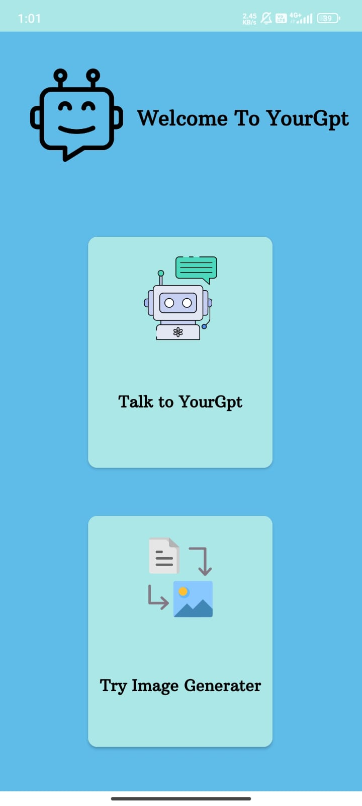
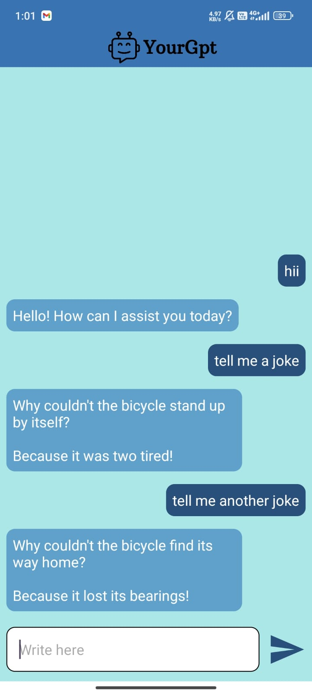
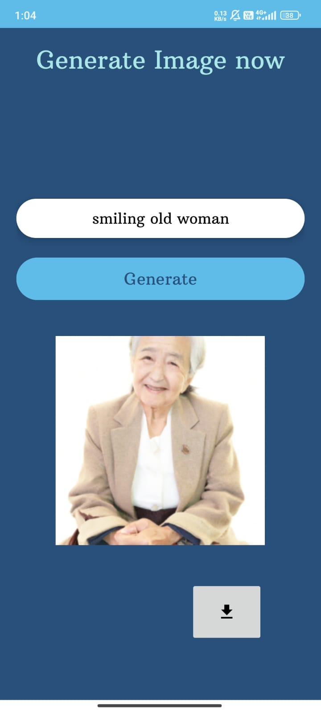

# YourGPT

## Overview
YourGPT is an Android application that combines the power of OpenAI's GPT-3.5 language model for natural language processing and an image generator. Users can ask queries, engage in conversations, and utilize the image generator to create visually appealing content.

## Features
Chat Interface: Engage in natural conversations with the GPT-3.5 language model.
Query Section: Ask any questions or seek information on various topics.
Image Generator: Utilize OpenAI's APIs to generate creative and unique images.
Easy to Use: User-friendly interface for seamless interaction.
Technologies Used
Language: Kotlin
Libraries:
OpenAI GPT-3.5 API for language processing
OkHttp3 for making API requests
Other relevant libraries (list them here)

# Screenshots

  
  

  
  

  
 

# Getting Started
Prerequisites
Android Studio installed
OpenAI API key 
Installation

Open the project in Android Studio.
Add your OpenAI API key in the appropriate configuration file.
kotlin
Copy code
// Add your OpenAI API key here
val apiKey = "your-api-key"
Build and run the application.
Usage
Launch the app on your Android device or emulator.
Use the chat interface to ask questions or engage in conversations.
Navigate to the image generator segment to create unique images.
Contributing
Contributions are welcome! If you have any ideas, bug fixes, or improvements, feel free to open an issue or submit a pull request.

# Acknowledgments
Special thanks to OpenAI for providing the powerful GPT-3.5 language model.
Thanks to the contributors and the open-source community.
